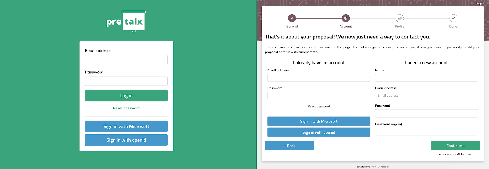

# pretalx Social Auth plugin

> [!CAUTION]
> This plugin is still under development and not ready for production use. It also uses signals currently only existing in [my fork of pretalx](https://github.com/adamskrz/pretalx/tree/social-auth)

This is a plugin for [pretalx](https://github.com/pretalx/pretalx). It provides an integration with [Python Social Auth](https://github.com/python-social-auth/social-core), allowing users to log in with third-party services.

Originally based on [social_django](https://github.com/python-social-auth/social-app-django) from the Python Social Auth project, but with the removal of deprecated features and the addition of pretalx-specific settings.

## Screenshots



## Configuration

In your `pretalx.cfg` file, add all the auth backends you need as a comma-separated list. Then, add the backend-specific settings to the `[plugin:pretalx_social_auth]` section. You can find the backend name and required settings in the [python-social-auth documentation](https://python-social-auth.readthedocs.io/en/latest/backends/index.html).

Example:

```ini
[project.entry-points."pretalx.plugin"]
pretalx_social_auth = "pretalx_social_auth:PretalxPluginMeta"

[authentication]
additional_auth_backends=social_core.backends.microsoft.MicrosoftOAuth2,social_core.backends.open_id.OpenIdAuth

[plugin:pretalx_social_auth]
SOCIAL_AUTH_MICROSOFT_GRAPH_KEY=xxxxx-xxxxx-xxxxx-xxxxx-xxxxxxxxxx
SOCIAL_AUTH_MICROSOFT_GRAPH_SECRET=xxxxxxxxxxxxxxxxxxxxxxxxxx
```

Instructions on adding custom backends will be added in the future.

Due to how Social Auth is configured with API keys in `settings.py`, this doesn't support configuring providers (backends) on a per-event basis. This means particular care should be taken where custom event domains are in use, as some providers require a different API key per domain (or adding valid redirect URLs).

I initially looked into using [django-allauth](https://github.com/pennersr/django-allauth) instead, which allows configuring providers in the database on a per-site basis, but it also replaces the full auth model, so would be more difficult to make into a plugin!

## Development setup

1. Make sure that you have a working [pretalx development setup](https://docs.pretalx.org/en/latest/developer/setup.html).

2. Clone this repository, eg to `local/pretalx-social-auth`.

3. Activate the virtual environment you use for pretalx development.

4. Run `pip install -e .` within this directory to register this application with pretalx's plugin registry.

5. Run `make` within this directory to compile translations.

6. Restart your local pretalx server. This plugin should show up in the plugin list shown on startup in the console.
   You can now use the plugin from this repository for your events by enabling it in the 'plugins' tab in the settings.

This plugin has CI set up to enforce a few code style rules. To check locally, you need these packages installed::

    pip install flake8 flake8-bugbear isort black djhtml

To check your plugin for rule violations, run::

    black --check .
    isort -c .
    djhtml -c .
    flake8 .

You can auto-fix some of these issues by running::

    isort .
    black .
    djhtml .
